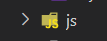
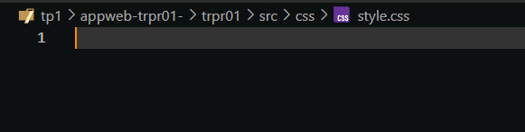
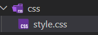

# Commentaires du professeur

### Ruptures de stock

L'ajout d'une notification de rupture en dehors de la liste de produits fait partie des bonnes pratiques par rapport à l'UI

> il n'y a pas de notification de rupture de stock hors de l'affichage dans la liste.

### Opérations sur les produits

Les boutons pour faire des opérations sur les produits auraient dû être en dehors des détails pour permettre des actions plus rapides. Ceci fait partie de la qualité de l'interface.

> les opération pouraient ne pas être dans le détail (2 clics)

---

# Commentaires personnels

### Dossier obsolète

Puisqu'il ne contient rien, le dossier *js* peut être enlevé sans problème pour réduire la quantité de contenu dans le dossier *src*.



### Contenu CSS obsolète

Le dosser *css* et le fichier *style.css* peuvent être enlevés puisqu'ils ne contiennent rien.





### Paramètre étrange dans la fonction *appProduct*

La paramètre *values* n'est pas très clair par rapport à ce qui est reçu. Une interface aurait été préférable.

```ts-vue{3,6-9}
//Version originale

function addProduct(values: [string, string, number, number]): void {
  products.value.push({
    id: nextId,
    name: values[0],
    description: values[1],
    price: values[2],
    stock: values[3]
  })

  nextId++
}
```

```ts-vue{3,10,13-16}
// Version améliorée

export interface ProductValues{
    name:string
    description:string
    price:number
    stock:number
}

function addProduct(values: ProductValues): void {
  products.value.push({
    id: nextId,
    name: values.name,
    description: values.description,
    price: values.price,
    stock: values.stock
  })

  nextId++
}
```

### Commentaires dans le code **HTML**

Des commentaires dans le code **HTML** auraient aider à la compréhension et au repérage.

```html
<!-- Extrait de code original -->

<h2 class="text-success">Ajouter un produit</h2>
      <div class="row">
        <div class="col-6" id="name">
          <label for="newName" class="label-form">Nom*</label>
          <input
            type="text"
            class="form-control"
            id="newName"
            v-model="newName"
          />
          <div class="text-danger">
            {{ newNameErrortext }}
          </div>
        </div>
        <div class="col-6" id="description">
          <label for="newDescription" class="label-form">Description</label>
          <input
            type="text"
            class="form-control"
            id="newDescription"
            v-model="newDescription"
          />
        </div>

        <!-- ... -->

        <div id="sendButton">
          <button
            type="button"
            class="btn btn-success mt-3"
            @click="sendForm()">
            Ajouter
          </button>
        </div>
      </div>
```

```html{7,9,16,22,24,36}
<!-- Extrait de code amélioré -->

<h2 class="text-success">Ajouter un produit</h2>

      <div class="row">
  
        <!-- Nom -->
        <div class="col-6" id="name"> 
          <!-- Entrée du nom -->
          <label for="newName" class="label-form">Nom*</label>
          <input
            type="text"
            class="form-control"
            id="newName"
            v-model="newName"/>
          <!-- Champ d'erreur du nom -->
          <div class="text-danger">
            {{ newNameErrortext }}
          </div>
        </div>

        <!-- Description -->
        <div class="col-6" id="description">
          <!-- Entrée de la description-->
          <label for="newDescription" class="label-form">Description</label>
          <input
            type="text"
            class="form-control"
            id="newDescription"
            v-model="newDescription"
          />
        </div>

        <!-- ... -->

        <!-- Bouton d'envoi du formulaire -->
        <div id="sendButton">
          <button
            type="button"
            class="btn btn-success mt-3"
            @click="sendForm()">
            Ajouter
          </button>
        </div>
      </div>
```

---
